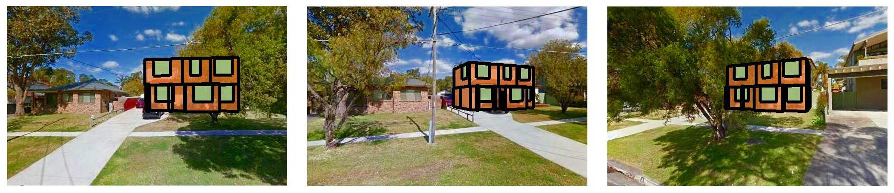

# HouseCraft
----
Source code of

**Hang Chu**, Shenlong Wang, Sanja Fidler, Raquel Urtasun. HouseCraft: Building Houses from Rental Ads and Street Views, ECCV 2016. ([paper](http://chuhang.github.io/files/publications/ECCV_16.pdf))|([project](http://www.cs.toronto.edu/housecraft))|([video](https://vimeo.com/174261051))

## How to run

No need for external packages or extra configurations. In MATLAB, just excute

`run`

Then you should see something like this:

```
step 1: compute all the renders, integral features, and losses  
processing house #74  
Processing time: 36.8836 seconds.  
step 2: compute all the final feature  
processing house #74  
Processing time: 29.5564 seconds.  
step 3: inference  
processing house #74  
Processing time: 1.0883 seconds.  
step 4: visualize  
```



## Test on the SydneyHouse dataset

TODO

## Utilities

